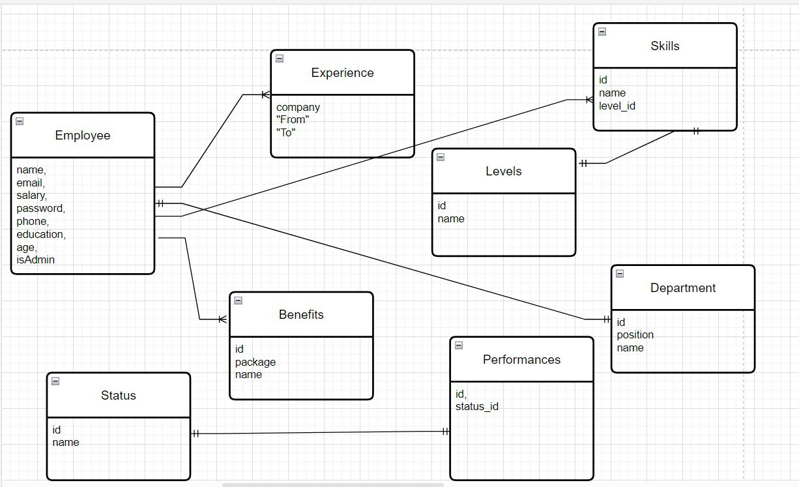

# Veera

# employees_managing_api
A Backend system for handling the employees of the organisation for the Admin of the company maintain the employee details.
## Technologies used

Node.js,Express,pg,brcypt,jwt,winston and express-async errors,node-mailer,twilio and webSockets.


# Hi, I'm Karan! 👋


## Installation

To start this API
```bash
git clone https://github.com/Karan1110/Infoware_Assignment.git
npm install
npm run seed
npm run dev
```

## Conceptual Model for the database design

    
##   Features of this API: 

```javascript
       
show me the hamsa

```

## API Reference

#### Users - 

```http
localhost:3000/users GET
localhost:3000/users/me GET
localhost:3000/users/:id GET
localhost:3000/users/ POST
localhost:3000/users/:id PUT
localhost:3000/users/:id DELETE 
```

| Parameter | Type     | Description                |
| :-------- | :------- | :------------------------- |
| `x-auth-token` | `string` | **Required**.your auth token |

####  Users
```http
localhost:3000/users/ POST
localhost:3000/users/:id PUT
localhost:3000/users/:id DELETE 
```

| Parameter | Type     | Description                |
| :-------- | :------- | :------------------------- |
| `x-auth-token` | `string` | **Required**.your auth token |
| `isAdmin` | `boolean` | **Required**.your authorization token |

#### Departments  -

```http
localhost:3000/departments POST
localhost:3000/departments PUT
localhost:3000/departments DELETE
```

| Parameter | Type     | Description                       |
| :-------- | :------- | :-------------------------------- |
| `x-auth-token`      | `string` | **Required**. your auth token |

#### Benefit packages
```http
Benefits
localhost:3000/benefits POST
localhost:3000/benefits PUT
localhost:3000/benefits DELETE
```

| Parameter | Type     | Description                       |
| :-------- | :------- | :-------------------------------- |
| `x-auth-token`      | `string` | **Required**. your auth token |

#### Experiences of the employees
```http
Experiences
localhost:3000/experiences POST
localhost:3000/experiences PUT
localhost:3000/experiences DELETE

```

| Parameter | Type     | Description                       |
| :-------- | :------- | :-------------------------------- |
| `x-auth-token`      | `string` | **Required**. your auth token |

#### Levels of the employee's skills
```http
Levels
localhost:3000/levels POST
localhost:3000/levels PUT
localhost:3000/levels DELETE
```

| Parameter | Type     | Description                       |
| :-------- | :------- | :-------------------------------- |
| `x-auth-token`      | `string` | **Required**. your auth token |

#### performances of the employees
```http
PERFORMANCES
localhost:3000/performances POST
localhost:3000/performances PUT
localhost:3000/performances DELETE
```

| Parameter | Type     | Description                       |
| :-------- | :------- | :-------------------------------- |
| `x-auth-token`      | `string` | **Required**. your auth token |

#### Skills of the employees

```http
Skills
localhost:3000/skills POST
localhost:3000/skills PUT
localhost:3000/skills DELETE
```

| Parameter | Type     | Description                       |
| :-------- | :------- | :-------------------------------- |
| `x-auth-token`      | `string` | **Required**. your auth token |

#### performance status for the employees

```http
Statuses
localhost:3000/statuses POST
localhost:3000/statuses PUT
localhost:3000/statuses DELETE
```

| Parameter | Type     | Description                       |
| :-------- | :------- | :-------------------------------- |
| `x-auth-token`      | `string` | **Required**. your auth token |


